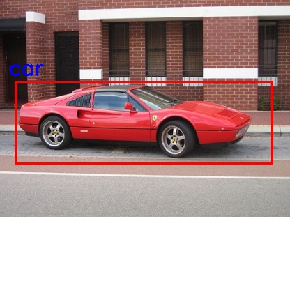
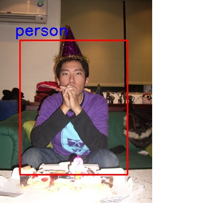
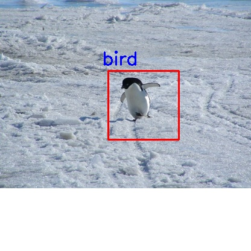
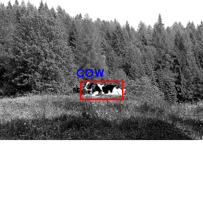
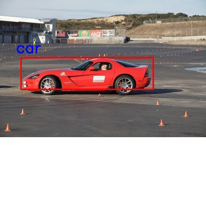

### Train

To train the model simply add the path to the voc dataset jpegimages and its corresponding annotation to train.py
and run :
```
python train.py
```

### Testing 

To test the model once the training is done, you need to specify the model path in the yolo_predict.py and run :

```
python yolo_predict.py
```

### Results





